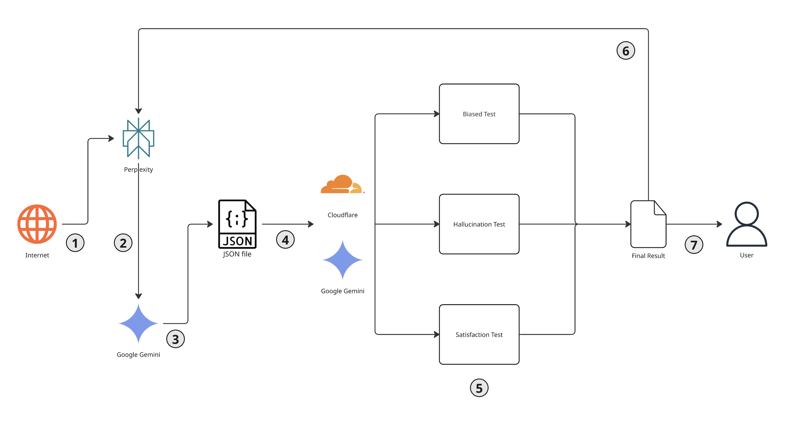
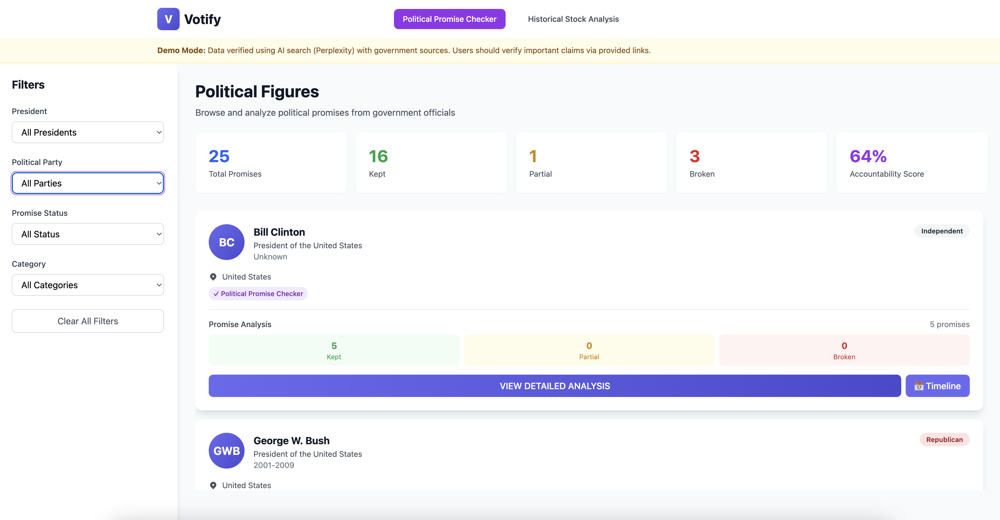
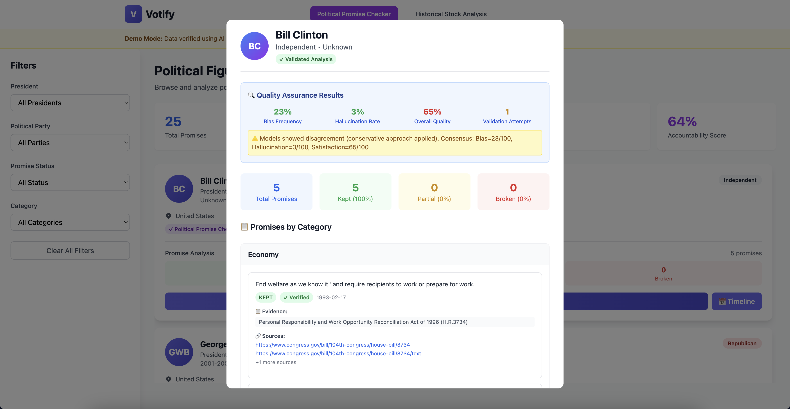
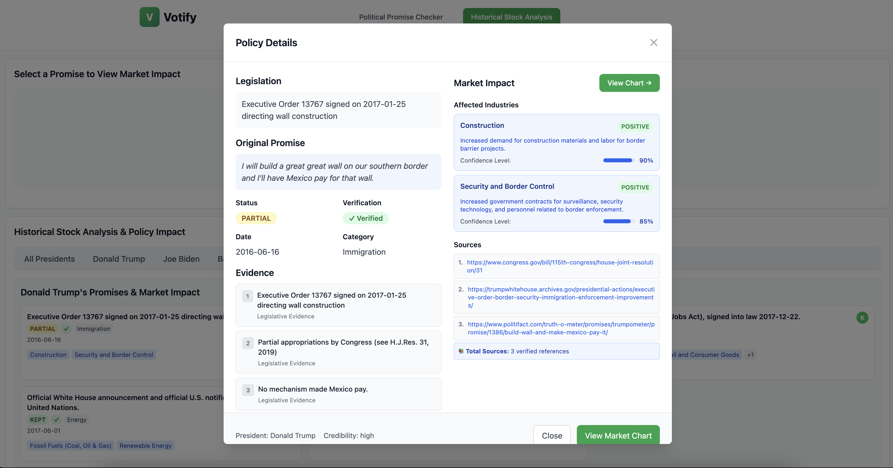
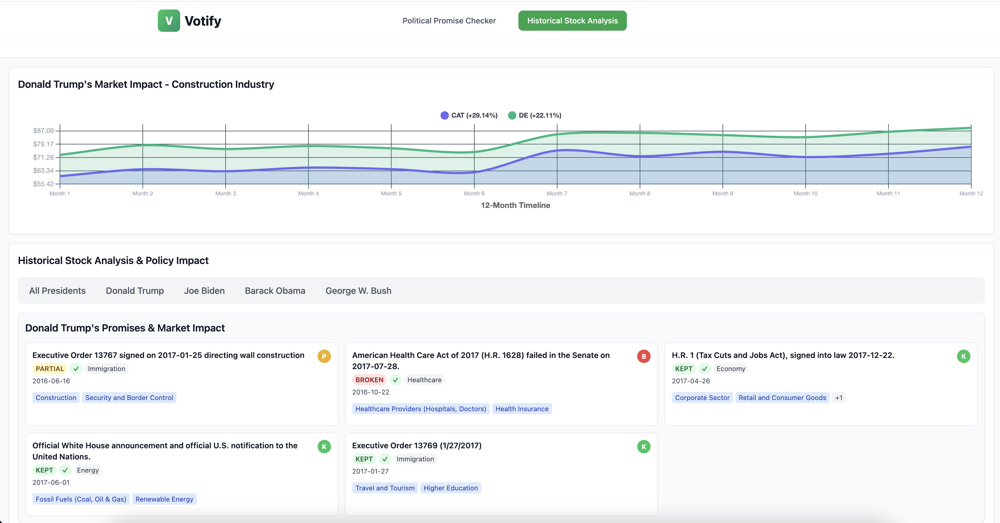

# Votify - AI-Powered Political Promise Tracker

Track political promises with AI-verified sources and real-time accountability metrics.

## Overview

Votify helps voters hold politicians accountable by tracking campaign promises against actual legislative actions. Using multi-AI verification (Perplexity + Gemini), we analyze 40+ verified promises from recent U.S. presidents to show which promises were kept, broken, or partially fulfilled.

## Features

- **Multi-AI Verification**: Promises verified through Perplexity API (source finding) and Gemini API (analysis)
- **Bias Detection**: Multi-AI consensus validation (Gemini + Cloudflare Workers AI) with automatic reloop
- **Government Source Validation**: Every promise linked to official sources (Congress.gov, WhiteHouse.gov, etc.)
- **Real-Time Dashboard**: Filter promises by president, status, or policy category
- **Stock Market Impact**: Real market data showing how promises affected industry sectors
- **Credibility Scoring**: Each promise rated for source quality and verification level

## Screenshots

### Architecture Overview
*[Screenshot: Backend architecture overview]*



### Landing Page
*[Screenshot: Landing page with "AI-Powered Political Promise Tracker" tagline]*


### Dashboard Overview
*[Screenshot: Full dashboard with 25 promise cards, filters, and stats]*



### Promise Analysis & Multi-AI Validation
*[Screenshot: Promise detail modal showing evidence, sources, and multi-AI bias detection results]*



### Policy Impact Details
*[Screenshot: Promise showing predicted vs actual industry impacts with credibility assessment]*



### Market Performance Chart
*[Screenshot: Stock market chart showing industry performance after policy implementation]*



## Tech Stack

**Frontend:**
- Vanilla JavaScript
- Tailwind CSS (CDN)
- Responsive design

**Tech Stack:**
- Node.js 16+ with ES Modules
- Express.js for REST API
- Perplexity AI API
- Google Gemini 2.5 Flash API
- Cloudflare Workers AI (optional - for multi-AI validation)
- Python 3.8+ (for validation scripts)

**Data:**
- 25 verified promises (5 per president: Clinton, Bush, Obama, Trump, Biden)
- Real government sources with credibility ratings
- Stock market impact data (Yahoo Finance via yfinance)
- JSON-based promise storage

## Quick Start

### Prerequisites
- Node.js 16+ 
- Perplexity API key
- Google Gemini API key
- Cloudflare API key
- Cloudflare Account ID

### Installation

1. **Clone the repository:**
   ```bash
   git clone https://github.com/yourusername/votify.git
   cd votify
   ```

2. **Install dependencies:**
   ```bash
   cd src/backend
   npm install
   ```

3. **Set up environment variables:**
   ```bash
   # Create .env file in src/backend/
   PERPLEXITY_API_KEY=your_perplexity_key
   GEMINI_API_KEY=your_gemini_key
   CLOUDFLARE_API_TOKEN=your_cloudflare_key
   CLOUDFLARE_ACCOUNT_ID=your_cloudflare_id
   ```

4. **Start the server:**
   ```bash
   node server.js
   ```

5. **Open the app:**
   Navigate to `http://localhost:3000/landing.html`

## Project Structure

```
votify/
├── src/
│   ├── frontend/
│   │   ├── landing.html          # Landing page
│   │   ├── dashboard.html        # Main promise tracker
│   │   └── styles/               # CSS files
│   └── backend/
│       ├── server.js             # Express server
│       ├── services/
│       │   ├── perplexity.js     # Promise discovery
│       │   ├── gemini.js         # Promise analysis
│       │   └── dataGenerator.js  # Data pipeline
│       └── data/
│           └── promises.json     # Verified promises database
├── README.md
└── package.json
```

## API Endpoints

### Core Endpoints

**Promise Management:**
```bash
GET  /api/promises                    # Get all verified promises
GET  /api/promises/generate           # Generate new promises (admin)
GET  /api/promises/enrich             # Add stock market data
POST /api/analyze-promise             # Analyze specific promise
POST /api/analyze-combined            # Analyze multiple promises
POST /api/analyze-combined-validated  # Analyze with bias detection + auto-reloop
GET  /api/stats                       # Get dashboard statistics
```

**Validation & Quality Control:**
```bash
POST /api/validate-promise            # Python VoteVerify validation (1-5 and 0-100 scores)
POST /api/validate-sample             # Statistical sampling validation
POST /api/bias-check                  # Single-AI bias detection (Gemini)
POST /api/multi-ai-bias-check         # Multi-AI consensus (Gemini + Cloudflare)
```

**Market Analysis:**
```bash
POST /api/market-chart                # Generate market impact chart for policy
```

**System:**
```bash
GET  /api/system-prompt               # Get VoteVerify system prompt
GET  /                                # API documentation
```

### Example API Usage

**Get All Promises:**
```bash
curl http://localhost:3000/api/promises
```

**Analyze Promise with Bias Detection:**
```bash
curl -X POST http://localhost:3000/api/analyze-combined-validated \
  -H "Content-Type: application/json" \
  -d '{
    "promises": [...],
    "president": "Barack Obama",
    "maxAttempts": 3
  }'
```

**Multi-AI Bias Check:**
```bash
curl -X POST http://localhost:3000/api/multi-ai-bias-check \
  -H "Content-Type: application/json" \
  -d '{
    "response": "...",
    "context": "Promise analysis"
  }'
```

## How It Works

1. **Promise Discovery**: Perplexity AI searches for campaign promises with government sources
2. **Verification**: Gemini AI validates promises against official records
3. **Analysis**: Each promise gets:
   - Status (kept/broken/partial)
   - Evidence from government sources
   - Credibility score (high/medium/low)
   - Industry impact predictions
4. **Dashboard**: Users filter and explore verified promises with real-time stats

## Data Quality

- **Source Verification**: All promises linked to official government websites
- **Credibility Ratings**: High/Medium/Low based on source quality
- **Multi-AI Validation**: Cross-checked between Perplexity and Gemini
- **Industry Impact**: Economic sector analysis for each promise

## Key Statistics

- 25 verified promises across 5 presidents
- 100% sourced from official government records
- Average credibility score: High
- Categories: Healthcare, Economy, Immigration, Energy, Defense, Education

## Browser Support

- Chrome/Edge (latest)
- Firefox (latest)
- Safari (latest)

## Development

### Adding New Promises

```bash
# Generate 5 new promises per president
curl http://localhost:3000/api/promises/generate
```

### Building for Production

```bash
npm run build
```

## Contributing

1. Fork the repository
2. Create a feature branch (`git checkout -b feature/AmazingFeature`)
3. Commit changes (`git commit -m 'Add AmazingFeature'`)
4. Push to branch (`git push origin feature/AmazingFeature`)
5. Open a Pull Request

## Team

Built at HackHarvard 2025 by:

[Blessing Amoah](https://github.com/BlessingAmoah) - Prompt Engineering<br>
[Peter Yuk](https://github.com/dyuk01) - Backend Development<br>
[Araf Latif](https://github.com/ARAFLATIF) - Frontend Development<br>
[Dylan D'rozario](https://github.com/dylandrozario) - Frontend Development<br>

## License

MIT License - see LICENSE file for details

## Acknowledgments

- Perplexity AI for promise discovery
- Google Gemini for promise analysis
- Congress.gov for official legislative data
- HackHarvard 2025 organizers

---

**Votify** - Making political accountability transparent through AI.